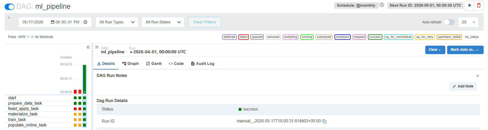
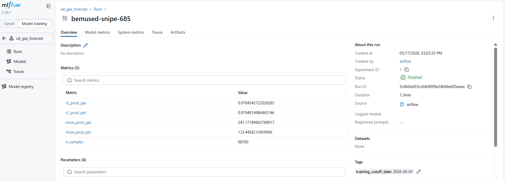
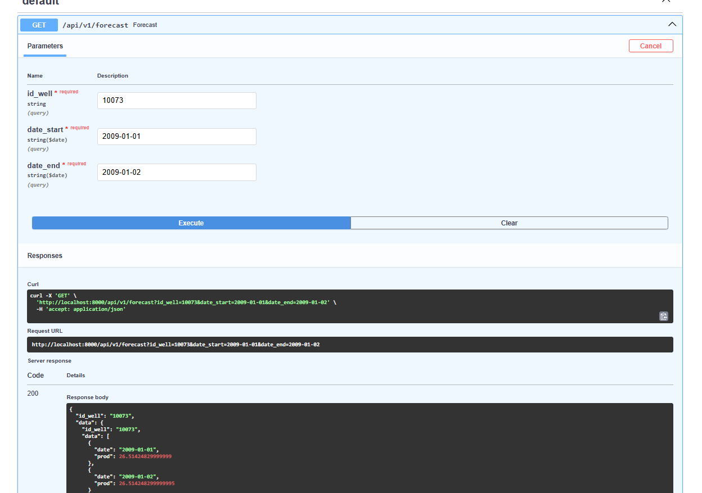

# Guía de reproducción — Entrega Final

Esta guía explica cómo levantar el sistema completo, correr el pipeline de ML con Airflow y probar la API. Está pensada para poder reproducir el setup desde cero a partir del código en el repositorio.

## Requisitos

- Docker Desktop instalado con integración WSL2 habilitada y abierto funcionando
- WSL2 con Ubuntu (el proyecto corre desde la terminal de WSL)

## Levantar el sistema

### 1. Clonar el repositorio, moverse a la carpeta y crear carpetas necesarias para Airflow

```bash
cd <carpeta del proyecto>
```

```bash
mkdir -p logs plugins
```

### 2. Buildear las imágenes

```bash
docker compose build
```

### 3. Levantar todos los servicios

```bash
docker compose up -d
```

Esto levanta: MLflow, PostgreSQL, Airflow (init + webserver + scheduler) y la API.

El `airflow-init` va a aparecer como `Exited` — eso es correcto, es un contenedor que corre una sola vez para inicializar la base de datos de Airflow y después termina.

### 4. Verificar que todo esté corriendo

```bash
docker compose ps -a
```

Deberías ver:
- `mlflow`: Up
- `postgres`: Up (healthy)
- `airflow-webserver`: Up
- `airflow-scheduler`: Up
- `airflow-init`: Exited (0) ← correcto
- `api`: puede aparecer como Exited (1) hasta que haya un modelo entrenado

### 5. Limpiar la base de datos de MLflow (solo la primera vez)

Necesario para que MLflow cree el experimento con la configuración correcta de almacenamiento:

```bash
docker compose exec mlflow rm -f /mlflow/data/mlflow.db
docker compose restart mlflow
```

Esperá unos segundos hasta que MLflow esté disponible en http://localhost:5000.

---

## Correr el pipeline de ML con Airflow

### 1. Entrar a la UI de Airflow

- URL: http://localhost:8080
- Usuario: `admin`
- Contraseña: `admin`

### 2. Triggerear el DAG

Buscá el DAG `ml_pipeline` en la lista y hacé click en el botón ▶ (Trigger DAG).

El pipeline ejecuta los siguientes pasos en orden:
1. **prepare_data**: descarga el CSV del portal de datos de energía y genera el parquet con features
2. **feast_apply**: registra las entidades y feature views en el feature store
3. **materialize**: copia las features al online store (desde 2006-01-01 hasta la fecha de ejecución)
4. **train**: entrena el modelo y lo registra en MLflow
5. **populate_online**: actualiza el online store con las últimas features por pozo

El primer run tarda varios minutos porque descarga el CSV completo (~400k filas).


### 3. Verificar el resultado en MLflow

- URL: http://localhost:5000
- El experimento `oil_gas_forecast` debe aparecer con un run registrado
- El modelo queda registrado como `oil_gas_forecast` con el alias `production`



### 4. Levantar la API (después de que el DAG termine)

```bash
docker compose restart api
```

---

## Entrenamiento: detalles técnicos

**Datos utilizados:** El dataset es de producción de pozos de gas y petróleo no convencional publicado por la Secretaría de Energía de Argentina. Tiene granularidad mensual (~400k filas totales).

**Muestreo:** Para controlar el uso de memoria, el entrenamiento usa un sample de **50.000 filas** (definido en `training/train.py` con `MAX_TRAINING_ROWS = 50_000`). Si querés cambiar ese límite, modificá esa constante.

**Fecha de corte:** La fecha de corte del entrenamiento no está hardcodeada — la toma automáticamente del contexto de ejecución de Airflow (`data_interval_end`). Cada vez que el DAG corre, el modelo se entrena con todos los datos disponibles hasta esa fecha.

**Update automático mensual:** El DAG tiene `schedule_interval="@monthly"` con `catchup=False`. Airflow lo ejecuta automáticamente el primer día de cada mes sin necesidad de intervención manual.

---

## Probar la API

- **Swagger UI (recomendado):** http://localhost:8000/docs — podés ejecutar los endpoints directamente desde el browser
- **Base URL:** http://localhost:8000

### GET /api/v1/wells

Devuelve los pozos con datos registrados en una fecha dada.

**Importante:** la fecha debe ser el primer día de un mes (`YYYY-MM-01`), ya que los datos son de granularidad mensual. El dataset tiene datos desde 2006 hasta aproximadamente 2024.

```bash
curl "http://localhost:8000/api/v1/wells?date_query=2007-06-01"
```

Fechas válidas de ejemplo: `2006-01-01`, `2007-06-01`, `2010-03-01`, `2015-01-01`

Porbar con 2008-02-01

**Respuesta:**
```json
[
  {"id_well": "40537"},
  {"id_well": "40538"}
]
```

### GET /api/v1/forecast

Devuelve el pronóstico de producción de gas para un pozo en un rango de fechas.

```bash
curl "http://localhost:8000/api/v1/forecast?id_well=40537&date_start=2008-01-01&date_end=2008-01-03"
```

**Parámetros:**
- `id_well`: ID del pozo (obtenido del endpoint `/wells`)
- `date_start`: fecha de inicio (`YYYY-MM-DD`)
- `date_end`: fecha de fin (`YYYY-MM-DD`)

Probar con 10073 2009-01-01 a 2009-01-02
**Respuesta:**
```json
{
  "id_well": "40537",
  "data": [
    {"date": "2008-01-01", "prod": 1234.5},
    {"date": "2008-01-02", "prod": 1234.5},
    {"date": "2008-01-03", "prod": 1234.5}
  ]
}
```

**Nota:** el valor de `prod` es el mismo para todos los días del rango porque el modelo fue entrenado con datos mensuales. El número representa la producción mensual estimada de gas para ese pozo.


---

## Troubleshooting

### El DAG falla en feast_apply_task con "Error parsing message"

Ocurre cuando hay un archivo registry.db corrupto o de una versión anterior en el directorio del proyecto. Como es un bind mount, sobrevive al docker compose down -v. Solución:

bash
rm -f feature_store/data/registry/registry.db


Re-triggeá el DAG — Feast va a crear un registry nuevo limpio.

---

## Links rápidos

| Servicio | URL |
|---|---|
| Airflow UI | http://localhost:8080 |
| MLflow UI | http://localhost:5000 |
| API Swagger | http://localhost:8000/docs |
| API base | http://localhost:8000 |
